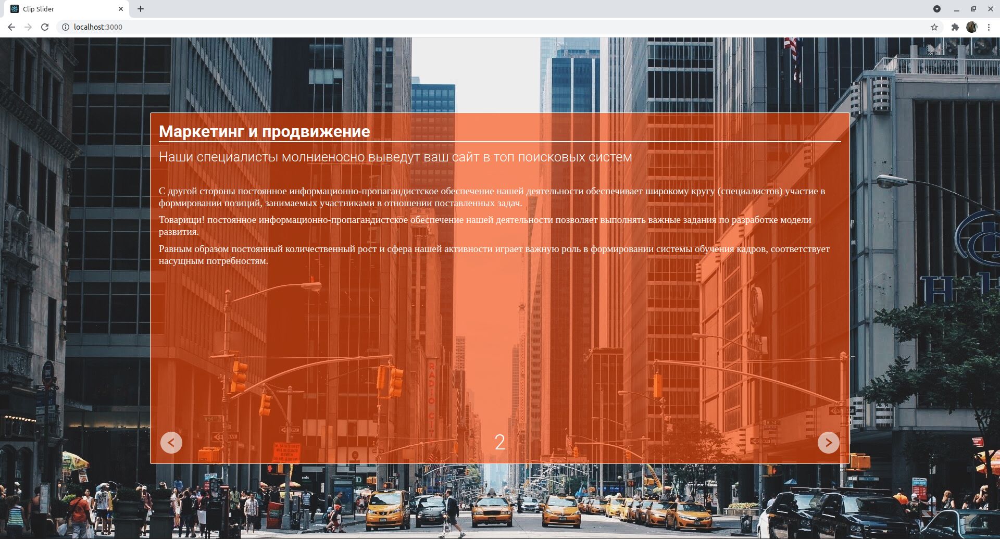
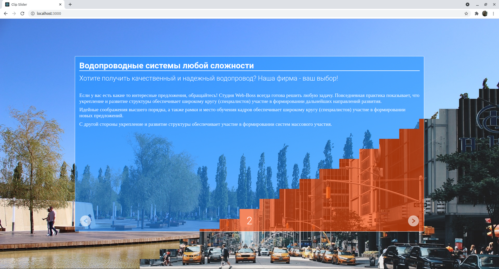
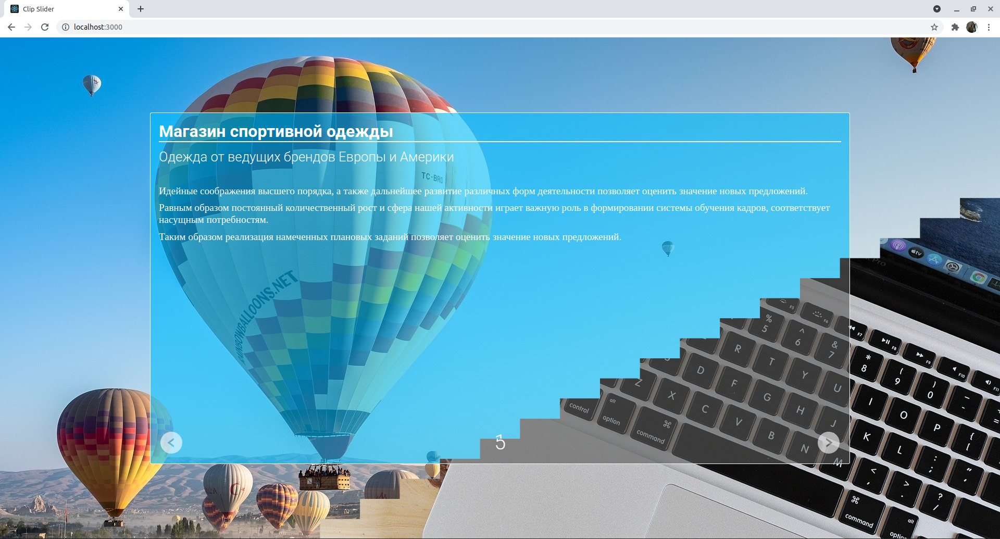

# clip_slider
Слайдер с интересным эффектом, основанным на использовании clip-path

Слайдер, основанный на использовании CSS-свойства clip-path. Координаты отсечения для clip-path подготавливаются с помощью специально написанного для этой цели [скрипта на python](https://github.com/SergeyLebidko/clip_path_generator). Слайды переключаются по таймеру с интервалом в 3 сек. Также можно переключать их вручную кликая на соответствующих кнопках на слайдах.

Деплой проекта доступен [по ссылке](https://hproger.ru/clip_slider/)

